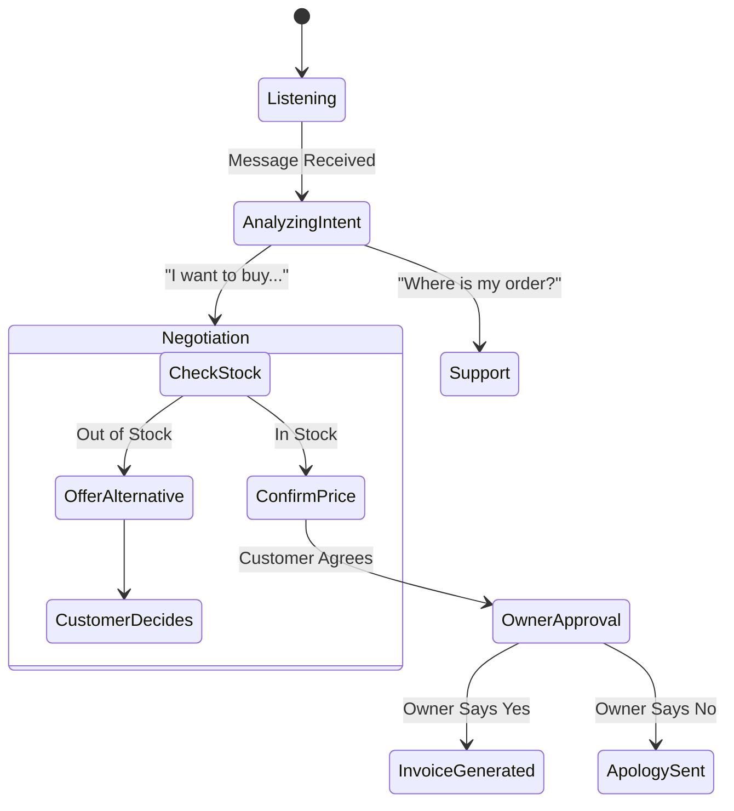

# 🧠 The AI Heart: How It Thinks

Bharat-Biz isn't just a wrapper around ChatGPT. It uses a sophisticated **Decision Engine** powered by Google's Gemini Flash 2.0 to handle complex business logic reliability.

---

## 🔄 The "Decision Tree" Architecture
The AI doesn't just "chat"; it follows a strict state machine to ensure business safety.

---

## 🧩 Key Intelligence Features

### 1. Intent Classification
Before replying, the AI classifies the message:
- Is this a new order?
- Is this a modification?
- Is this just casual chit-chat?
- is this a payment screenshot?

### 2. Entity Extraction
It extracts structured data from unstructured conversations:
- **"500 meter neela kapda"** -> `{ material: "cotton", color: "blue", quantity: 500, unit: "meter" }`
- **"Do sau"** -> `{ quantity: 200 }` (Context aware).

### 3. Context Retention
The AI remembers the entire session state in the database.
- If a customer says "Make it 600" five minutes later, the AI knows *what* to make 600.

### 4. Safety Rails
- **Price Protection**: The AI cannot sell below a set base price without owner approval.
- **Stock Protection**: It will never promise inventory that acts as "Reserved" but not "Confirmed" until payment.

---

## 🛠️ Tech Stack
- **Model**: Gemini 1.5 Flash (Low latency, high reasoning).
- **Vision**: Gemini Pro Vision (Fabric analysis).
- **Audio**: OpenAI Whisper (Voice to Text).
- **Framework**: LangChain / Custom Python Logic.

---

[⬅️ Back to Showcase](../PROJECT_SHOWCASE.md)
