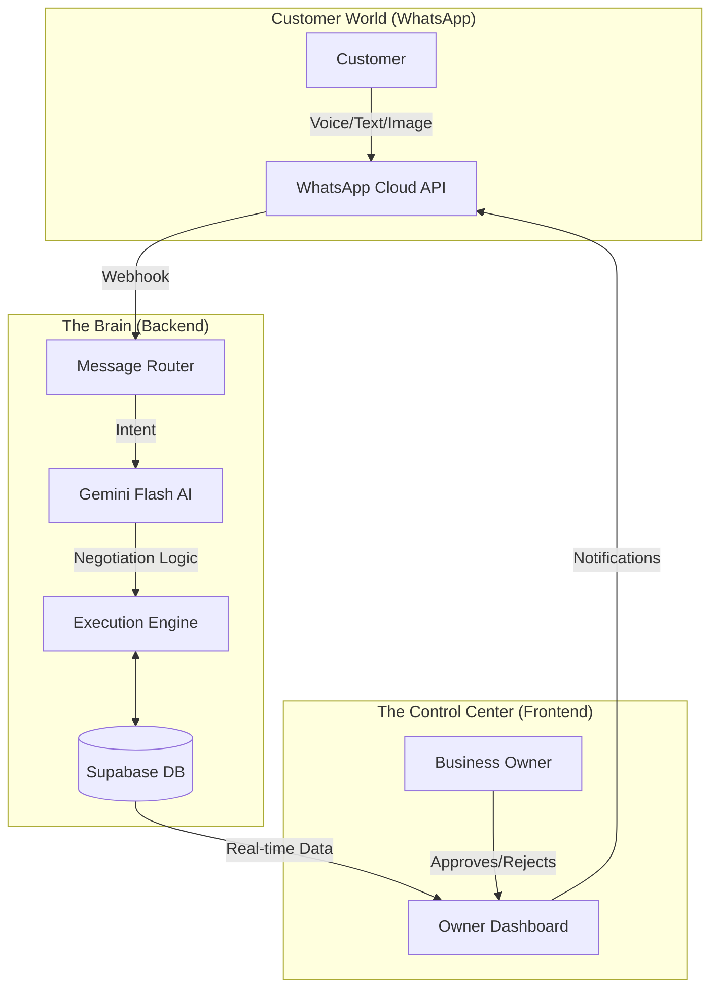

# Saathi AI: The AI-Powered Operating System for Textile Businesses (B2B)

> **"Where Ancient Trade Meets Artificial Intelligence"**

Saathi AI is a comprehensive, AI-first platform designed to modernize the traditional Indian textile business. It bridges the gap between chaotic, informal WhatsApp-based trade and structured, data-driven business management.

Does your business run on WhatsApp? **So does Saathi AI.**

by Team Fauxfly

---

## 🌟 Capabilities at a Glance

| Feature | Description |
| :--- | :--- |
| **🤖 WhatsApp AI Agent** | A tireless assistant that negotiates prices, checks stock, and takes orders 24/7 in **Hinglish**, Voice, and Text. |
| **📦 Smart Inventory** | Real-time tracking of fabrics, colors, and batches. It knows *exactly* what you have down to the loose meter. |
| **🧠 Intelligent Negotiation** | It doesn't just take orders; it *negotiates*. If you're out of "Blue Cotton", it sells "Navy Blue Linen". |
| **🎙️ Voice & Vision First** | Customers can send voice notes saying *"Bhaiya, 50 meter laal kapda chahiye"* or photos of fabric, and the AI understands. |
| **📊 Owner Dashboard** | A "Glass Cockpit" for the business owner. Approve orders, track revenue, and manage the empire from one screen. |

---

## 🏗️ The System Architecture

A high-level view of how Saathi AI powers your trade:

---

## 📚 Explore the System

We have divided the detailed documentation into four key sections:

### [1. The WhatsApp AI Assistant](./docs/1_WHATSAPP_ASSISTANT.md)
> *How the AI talks to your customers like a pro sales agent.*
> - Handling "Hinglish" voice notes.
> - Understanding fabric photos.
> - The Art of Negotiation.

### [2. The Business Dashboard](./docs/2_BUSINESS_DASHBOARD.md)
> *Your Command Center.*
> - Order Approvals (The "Tinder for Orders" interface).
> - Live Inventory Management.
> - Financial Health & Invoicing.

### [3. The AI Engine](./docs/3_AI_BRAIN.md)
> *Under the hood of the Intelligence.*
> - How it decides when to sell and when to ask the owner.
> - Context memory & continuity.
> - Smart "Upselling" logic.

### [4. Deployment & Setup](./docs/4_SETUP_GUIDE.md)
> *Technical details for the judges.*
> - Dockerized setup.
> - Tech Stack: FastAPI, React, PostgreSQL, Gemini Flash.

---

## 🏆 Why Saathi AI?

Traditional ERPs fail in India because they require data entry. **Saathi AI requires zero data entry.** 

- **It listens.**
- **It sees.**
- **It remembers.**

It turns the chaos of WhatsApp chat logs into a structured, searchable, and profitable business database.

---

*Built with ❤️ for the Future of Indian Trade.*
